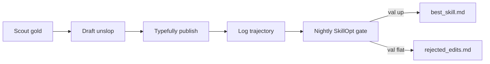

# grokbot-x

**Self-learning X/Twitter growth system for Grok Bot.**

Searching GitHub for Grok Bot / GrokBot automations / Twitter growth agents
and getting prompt packs that spam compose? This is the other thing: a
copy-first kit anyone can run. Scout gold. Draft like a human. Publish
through Typefully so X does not stamp Made with AI. Log what shipped.
Let SkillOpt rewrite the playbook overnight.

Built for tired founders. Dumbed down on purpose.

## What it does

- **Scout gold, not "nice posts".** Views >> followers. Keep a parent at
  >= 12x (better >= 20x) with climbable replies. Dead diaries are out.
- **Draft unslop.** Phone-typed. One thought. No LinkedIn-GPT. Skills
  included so Grok Bot stops writing like a brand intern.
- **Publish without the AI badge.** Typefully OAuth for originals.
  Replies = Typefully draft, then Publish NOW in the UI. Never bot-browser
  compose on x.com.
- **Log every ship.** One JSON line. Views later. That file is the
  training set.
- **Nightly SkillOpt gate.** microsoft/skillopt-style: <= 4 edits, held-out
  val must strictly improve, rejects go to a buffer. The bot only doubles
  down on what worked.

## Architecture



No browser compose in that loop. Typefully is the publish lane.
SkillOpt is the learning lane.

## Why Made with AI happens

If Grok Bot (or Playwright, or any datacenter browser) types into x.com
compose, X can stamp **Made with AI** even when you left disclosure OFF.
It is a session fingerprint, not a toggle you forgot.

Fix: connect @YOUR_HANDLE to Typefully with OAuth on your own phone or
laptop. Then the API / Typefully UI is an official client. Set
`made_with_ai: false`. Details in [docs/PUBLISH.md](docs/PUBLISH.md).

## Gold targeting

```
viral_ratio = parent_views / parent_followers
```

| Keep | Skip |
|---|---|
| >= 12x, ideally >= 20x | < 5x, or "useful" and going nowhere |
| Replies still climbable | Reply wall already full |
| Early velocity for post age | Big following, mid views |
| ICP readers | Off-niche virality |

Cold account truth: replies under gold are the reach channel you own.
Filler originals in empty hours teach nothing. Bank the slot.

Widen scouting past English if your buyers live in FR / DE / ES / IT.
Same bar. Less reply competition. Reply in the parent language.

## Self-learning (SkillOpt)

`skillopt/best_skill.md` is the trainable state. The model stays frozen.

1. Roll out (ship + log).
2. Harvest metrics.
3. Reflect on train rows.
4. Propose <= 4 add/delete/replace edits.
5. Accept only if held-out val mean score strictly improves.
6. Otherwise append `rejected_edits.md` and keep last night's skill.

Scorer and bookkeeping: `python3 skillopt/sleep_cycle.py status`

Read [docs/SKILLOPT.md](docs/SKILLOPT.md) and
[microsoft/SkillOpt](https://github.com/microsoft/SkillOpt).

## Setup

```bash
cp .env.example .env
# set YOUR_TYPEFULLY_API_KEY, YOUR_HANDLE, YOUR_SOCIAL_SET_ID
# YOUR_SOCIAL_SET_ID == YOUR_TYPEFULLY_SOCIAL_SET_ID

cp examples/best_skill.starter.md skillopt/best_skill.md
cp skillopt/held_out.example.json skillopt/held_out.json
# optional dry run of the scorer:
cp examples/trajectories.example.jsonl skillopt/trajectories.jsonl
python3 skillopt/sleep_cycle.py status
```

Env vars:

| Var | What |
|---|---|
| `YOUR_HANDLE` | X handle, no @ |
| `YOUR_TYPEFULLY_API_KEY` | Typefully Settings -> API |
| `YOUR_TYPEFULLY_SOCIAL_SET_ID` / `YOUR_SOCIAL_SET_ID` | social set id from Typefully Development mode |
| `SKILLOPT_DIR` | optional override for the skillopt folder |

Then:

1. Fill [docs/BRAND-BIBLE.template.md](docs/BRAND-BIBLE.template.md).
2. Drop the five `skills/*/SKILL.md` files into your Grok Bot skill
   directory.
3. Follow [docs/PLAYBOOK.md](docs/PLAYBOOK.md).

Helpers:

```bash
python3 scripts/publish_original.py --text "your copy"
python3 scripts/create_reply_draft.py --text "your reply" --reply-to URL
```

## Repo map

```
docs/PLAYBOOK.md                 start here
docs/PUBLISH.md                  Typefully originals vs replies
docs/SKILLOPT.md                 nightly gate
docs/BRAND-BIBLE.template.md     fill-in product doctrine
docs/OPERATOR.md                 generic operator rules
docs/x-human-cadence.md
docs/x-publish-no-ai-label.md
docs/x-article-intent-engine.md
skills/                          Grok Bot SKILL.md files
skillopt/sleep_cycle.py          scorer + gate bookkeeping
skillopt/best_skill.md           deployed skill
examples/                        fake trajectories + starter skill
scripts/                         Typefully helpers
```

## GitHub topics

These topics are already set on the GitHub repository:

`grok` `grok-bot` `grokbot` `twitter` `x-twitter` `marketing-automation` `growth-hacking`
`skillopt` `self-learning-agents` `typefully` `ai-agents`

## License

MIT. Copyright 2026 Grok Bot X contributors.

## Disclaimer

Not affiliated with xAI, X/Twitter, Typefully, or Microsoft.
Educational kit. Do not spam. Human cadence is required. You are
responsible for what you publish and for staying inside each
platform's rules. No growth numbers are claimed here. Run it, log
your own.
